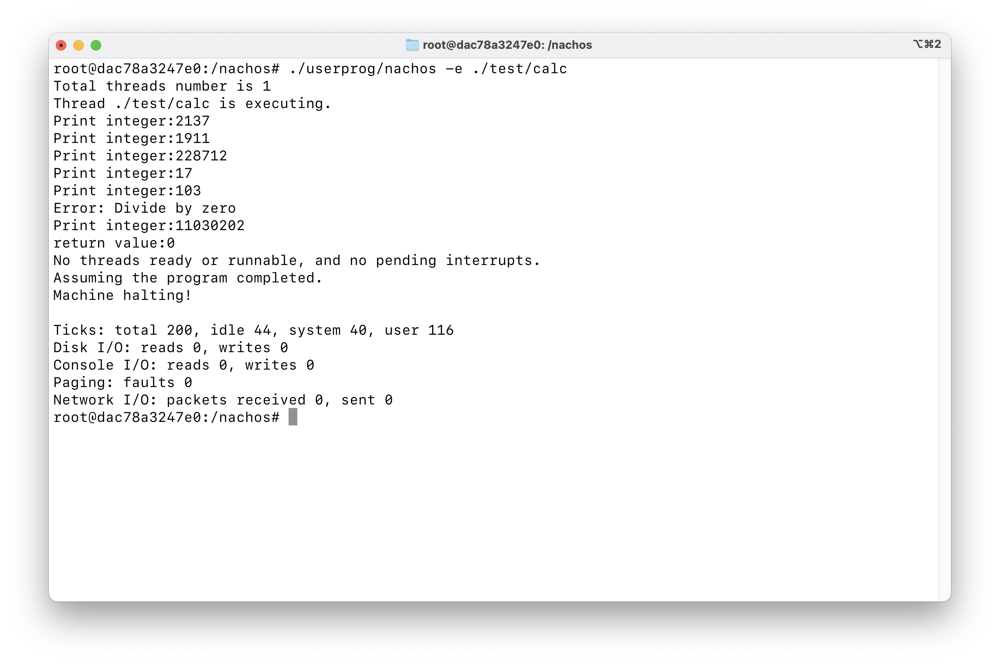

# Homework 01

> NTUST Course Project  
> Course No: `CS3009301`  
> Course Name: Operating Systems  
> Author: Hayden Chang 張皓鈞 B11030202  
> Email: B11030202@mail.ntust.edu.tw

## Description

This project use a fork version of NachOS to running in Docker.

For more information, please refer to the [repository](https://github.com/hayd1n/NachOS-Docker).

## Prerequisite for Running in Docker

> ⚠️ This project only support x86_64 architecture machine.

Running NachOS in Docker is the easiest way to get started.

### Install Docker

Install [Docker Engine](https://docs.docker.com/engine/install/) and [Compose Plugin](https://docs.docker.com/compose/install/linux/)

### Run Docker Image

Navigate to the `NachOS` directory.
Start the Docker container in the background.

```shell
cd NachOS-Docker
docker compose up -d
```

### Start a Shell in the Docker Container

```shell
docker exec -it nachos-docker-nachos-1 /bin/bash
```

## Prerequisite for Running on Ubuntu

> Support Ubuntu 22.04 LTS 64-bit

### Install Required Packages

#### Enable i386 architecture

```shell
sudo dpkg --add-architecture i386
```

#### Preform system upgrade

```shell
sudo apt update; sudo apt dist-upgrade
```

### Install the dependency (csh/git/compiler)

```shell
sudo apt install csh ed git build-essential gcc-multilib g++-multilib gdb gdb-
multiarch
```

### Install cross-compiler

Copy the cross-compiler to the system directory

```shell
sudo cp –r usr /
```

## Building NachOS

Enter the shell in the container first, then run `make` to build NachOS

```shell
make
```

## 1. `sleep` syscall

### Modified Files

#### threads/scheduler.h

```cpp
class SleepFunc {
public:
    SleepFunc() : currentINT(0) {}
    void napTime(Thread* t, int x);
    bool wakeUp();
    bool isEmpty();

private:
    class SleepT {
    public:
        SleepT(Thread* t, int x) : thread(t), when(x) {}
        Thread* thread;
        int when;
    };

    int currentINT;
    std::list<SleepT> tList;
};
```

#### threads/scheduler.cc

```cpp
bool SleepFunc::isEmpty() { return tList.size() == 0; }

void SleepFunc::napTime(Thread *t, int x) {
    ASSERT(kernel->interrupt->getLevel() == IntOff);
    tList.push_back(SleepT(t, currentINT + x));
    t->Sleep(false);
}

bool SleepFunc::wakeUp() {
    bool woken = false;
    currentINT++;
    for ( std::list<SleepT>::iterator it = tList.begin(); it != tList.end(); ) {
        if ( it->when == currentINT ) {
            it->thread->setStatus(READY);
            kernel->scheduler->ReadyToRun(it->thread);
            it = tList.erase(it);
            woken = true;
        } else {
            it++;
        }
    }
    return woken;
}
```

#### threads/alarm.h

```cpp
// The following class defines a software alarm clock.
class Alarm : public CallBackObj {
public:
    Alarm(bool doRandomYield);  // Initialize the timer, and callback
                                // to "toCall" every time slice.
    ~Alarm() { delete timer; }

    void WaitUntil(int x);  // suspend execution until time > now + x

private:
    Timer *timer;  // the hardware timer device

    SleepFunc sleeper;  // Homework 01

    void CallBack();  // called when the hardware
                      // timer generates an interrupt
};
```

#### threads/alarm.cc

```cpp
void Alarm::CallBack() {
    Interrupt* interrupt = kernel->interrupt;
    MachineStatus status = interrupt->getStatus();

    bool woken = sleeper.wakeUp();
    if ( status == IdleMode && !woken && sleeper.isEmpty() ) {  // is it time to quit?
        if ( !interrupt->AnyFutureInterrupts() ) {
            timer->Disable();  // turn off the timer
        }
    } else {  // there's someone to preempt
        interrupt->YieldOnReturn();
    }
}

void Alarm::WaitUntil(int x) {
    IntStatus oldLevel = kernel->interrupt->SetLevel(IntOff);
    Thread* t = kernel->currentThread;
    cout << "Alarm:WaitUntil go sleep" << endl;
    sleeper.napTime(t, x);
    kernel->interrupt->SetLevel(oldLevel);
}
```

#### userprog/syscall.h

```cpp
#define SC_Sleep 12

void Sleep(int msecs);
```

#### test/start.s

```mips
    .global Sleep
    .ent    Sleep
Sleep:
    addiu  $2,$0,SC_Sleep
    syscall
    j $31
    .end    Sleep

    .global Add
    .ent    Add
```

#### userprog/exception.cc

```cpp
case SC_Sleep:
    val = kernel->machine->ReadRegister(4);
    cout << "Sleep Time: " << val << "(ms)" << endl;
    kernel->alarm->WaitUntil(val);
    return;
```

### Test Program

in `test/sleep.c`

```c
#include "syscall.h"

int main() {
    int i;
    for ( i = 1; i <= 5; i++ ) {
        PrintInt(i);
        Sleep(1000000 * i);
    }
}
```

#### Output

```
root@dac78a3247e0:/nachos# ./userprog/nachos -e ./test/sleep
Total threads number is 1
Thread ./test/sleep is executing.
Print integer:1
Sleep Time: 1000000(ms)
Alarm:WaitUntil go sleep
Print integer:2
Sleep Time: 2000000(ms)
Alarm:WaitUntil go sleep
Print integer:3
Sleep Time: 3000000(ms)
Alarm:WaitUntil go sleep
Print integer:4
Sleep Time: 4000000(ms)
Alarm:WaitUntil go sleep
Print integer:5
Sleep Time: 5000000(ms)
Alarm:WaitUntil go sleep
return value:0
No threads ready or runnable, and no pending interrupts.
Assuming the program completed.
Machine halting!

Ticks: total 1500000100, idle 1499999779, system 130, user 191
Disk I/O: reads 0, writes 0
Console I/O: reads 0, writes 0
Paging: faults 0
Network I/O: packets received 0, sent 0
```


## 2. Caculation syscalls

Implement the following system calls:

- `Add`
- `Sub`
- `Mul`
- `Div`
- `Mod`

### Modified Files

#### userprog/syscall.h

```cpp
#define SC_Add 13
#define SC_Sub 14
#define SC_Mul 15
#define SC_Div 16
#define SC_Mod 17

// Calc
int Add(int op1, int op2);
int Sub(int op1, int op2);
int Mul(int op1, int op2);
int Div(int op1, int op2);
int Mod(int op1, int op2);
```

#### userprog/exception.cc

```cpp
void ExceptionHandler(ExceptionType which) {
    ...
    switch ( which ) {
    case SyscallException:
        switch ( type ) {
        ...
        case SC_Add: {
            int op1 = kernel->machine->ReadRegister(4);
            int op2 = kernel->machine->ReadRegister(5);
            int result = op1 + op2;
            kernel->machine->WriteRegister(2, result);
            return;
        }
        case SC_Sub: {
            int op1 = kernel->machine->ReadRegister(4);
            int op2 = kernel->machine->ReadRegister(5);
            int result = op1 - op2;
            kernel->machine->WriteRegister(2, result);
            return;
        }
        case SC_Mul: {
            int op1 = kernel->machine->ReadRegister(4);
            int op2 = kernel->machine->ReadRegister(5);
            int result = op1 * op2;
            kernel->machine->WriteRegister(2, result);
            return;
        }
        case SC_Div: {
            int op1 = kernel->machine->ReadRegister(4);
            int op2 = kernel->machine->ReadRegister(5);
            if ( op2 == 0 ) {
                cerr << "Error: Divide by zero" << endl;
                kernel->machine->WriteRegister(2, STUDENT_ID);
            } else {
                int result = op1 / op2;
                kernel->machine->WriteRegister(2, result);
            }
            return;
        }
        case SC_Mod: {
            int op1 = kernel->machine->ReadRegister(4);
            int op2 = kernel->machine->ReadRegister(5);
            if ( op2 == 0 ) {
                cerr << "Error: Divide by zero" << endl;
                kernel->machine->WriteRegister(2, STUDENT_ID);
            } else {
                int result = op1 % op2;
                kernel->machine->WriteRegister(2, result);
            }
            return;
        }
        ...
        }
    }
    ...
}
```

#### test/start.s

```mips
    .global Add
    .ent    Add

Add:
    addiu  $2,$0,SC_Add
    syscall
    j $31
    .end    Add

    .global Sub
    .ent    Sub
Sub:
    addiu  $2,$0,SC_Sub
    syscall
    j $31
    .end    Sub

    .global Mul
    .ent    Mul
Mul:
    addiu  $2,$0,SC_Mul
    syscall
    j $31
    .end    Mul

    .global Div
    .ent    Div
Div:
    addiu  $2,$0,SC_Div
    syscall
    j $31
    .end    Div

    .global Mod
    .ent    Mod
Mod:
    addiu  $2,$0,SC_Mod
    syscall
    j $31
    .end    Mod
```

### Test Program

in `test/calc.c`

```c
#include "syscall.h"

int main() {
    int op1, op2;
    int a, b, c, d, e, div0;
    op1 = 2024;
    op2 = 113;
    a = Add(op1, op2);
    b = Sub(op1, op2);
    c = Mul(op1, op2);
    d = Div(op1, op2);
    e = Mod(op1, op2);
    PrintInt(a);
    PrintInt(b);
    PrintInt(c);
    PrintInt(d);
    PrintInt(e);
    div0 = Div(1, 0);
    PrintInt(div0);
}
```

#### Output

```
root@dac78a3247e0:/nachos# ./userprog/nachos -e ./test/calc
Total threads number is 1
Thread ./test/calc is executing.
Print integer:2137
Print integer:1911
Print integer:228712
Print integer:17
Print integer:103
Error: Divide by zero
Print integer:11030202
return value:0
No threads ready or runnable, and no pending interrupts.
Assuming the program completed.
Machine halting!

Ticks: total 200, idle 44, system 40, user 116
Disk I/O: reads 0, writes 0
Console I/O: reads 0, writes 0
Paging: faults 0
Network I/O: packets received 0, sent 0
```



## 3. `print` syscall

### Modified Files

#### userprog/syscall.h

```cpp
#define SC_Print 18

// Print
int Print(char *str);
```

#### userprog/exception.cc

```cpp
void ExceptionHandler(ExceptionType which) {
    ...
    switch ( which ) {
    case SyscallException:
        switch ( type ) {
        ...
        case SC_Print: {
            /*
             * Because my student ID is B11030202, I will print the string start with
             * `[B11030202_Print]` and due to the last two characters of my student ID is `02`, 02 %
             * 26 = 2, so I will replace `B` and `b` with `*`.
             */
            cout << "[B11030202_Print]";
            val = 0;
            for ( int addr = kernel->machine->ReadRegister(4);; addr++ ) {
                int v;
                bool success = kernel->machine->ReadMem(addr, 1, &v);
                if ( !success ) {
                    cerr << "Error: ReadMem failed" << endl;
                    break;
                }

                char c = (char)v;
                // Break if the character is '\0'
                if ( c == '\0' ) {
                    break;
                }

                // Replace the character
                if ( c == PRINT_REPLACE_CHAR_1 || c == PRINT_REPLACE_CHAR_2 ) {
                    cout << "*";
                } else {
                    cout << c;
                }

                // Count the number of characters only which have been printed
                val++;
            }
        }
        }
        ...
    }
    ...
}
```

#### test/start.s

```mips
    .global Print
    .ent    Print
Print:
    addiu  $2,$0,SC_Print
    syscall
    j $31
    .end    Print
```

### Test Program

in `test/printstr.c`

```c
#include "syscall.h"

int main() {
    int len;
    len = Print("Hello NachOS2024!\n");
    PrintInt(len);
    len = Print("Have a nice day at school!\n");
    PrintInt(len);
    len = Print("ABCDEFGHIJKLMNOPQRSTUVWXYZ\n");
    PrintInt(len);
    len = Print("abcdefghijklmnopqrstuvwxyz\n");
    PrintInt(len);
}
```

#### Output

```
root@dac78a3247e0:/nachos# ./userprog/nachos -e ./test/printstr
Total threads number is 1
Thread ./test/printstr is executing.
[B11030202_Print]Hello NachOS2024!
Print integer:18
[B11030202_Print]Have a nice day at school!
Print integer:27
[B11030202_Print]A*CDEFGHIJKLMNOPQRSTUVWXYZ
Print integer:27
[B11030202_Print]a*cdefghijklmnopqrstuvwxyz
Print integer:27
return value:0
No threads ready or runnable, and no pending interrupts.
Assuming the program completed.
Machine halting!

Ticks: total 200, idle 83, system 40, user 77
Disk I/O: reads 0, writes 0
Console I/O: reads 0, writes 0
Paging: faults 0
Network I/O: packets received 0, sent 0
```


## 4. Debug Flag

Because my student ID is `B11030202`, the last two characters are `02` and `02 % 26 % 10 = 2`, so I will use `2` as the flag.

### Modified Files

#### lib/debug.h

```cpp
const char dbgHW1 = '2';
```

#### threads/main.cc

```cpp
int main(int argc, char **argv) {

    ...

    debug = new Debug(debugArg);

    // Homework 1
    DEBUG(dbgHW1, "[DEBUG]B11030202");

    kernel = new KernelType(argc, argv);
    kernel->Initialize();

    ...

}
```

#### Test Result

```
root@dac78a3247e0:/nachos# ./userprog/nachos -d 2 -e ./test/halt
[DEBUG]B11030202
Total threads number is 1
Thread ./test/halt is executing.
Machine halting!

Ticks: total 42, idle 0, system 30, user 12
Disk I/O: reads 0, writes 0
Console I/O: reads 0, writes 0
Paging: faults 0
Network I/O: packets received 0, sent 0
```


