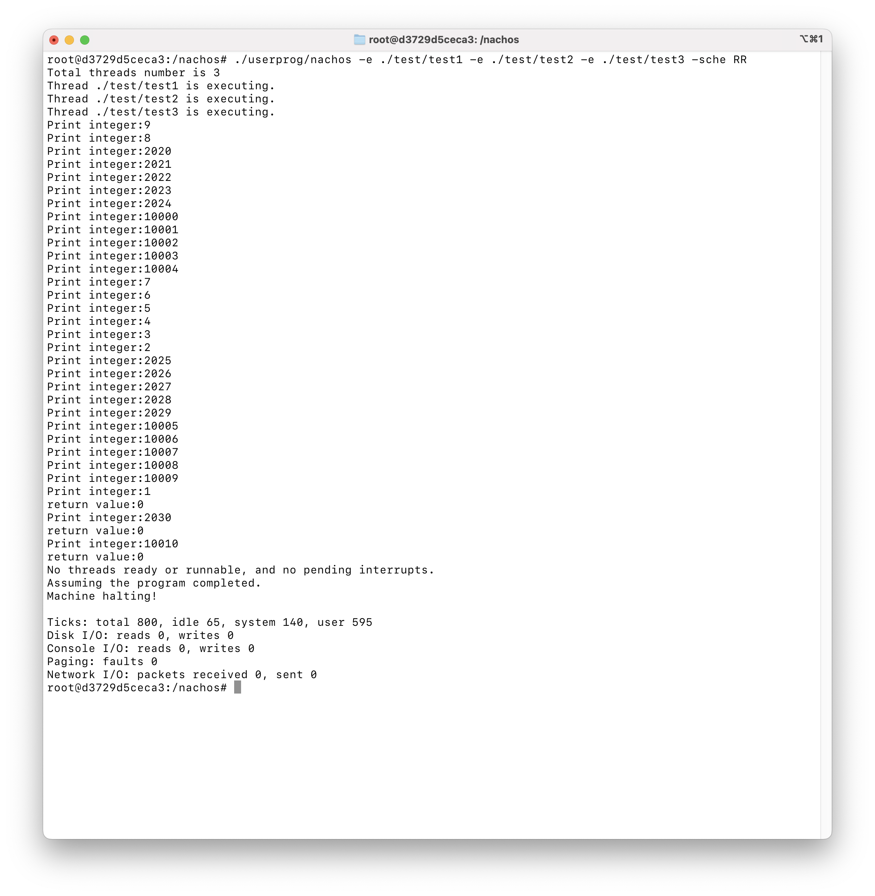
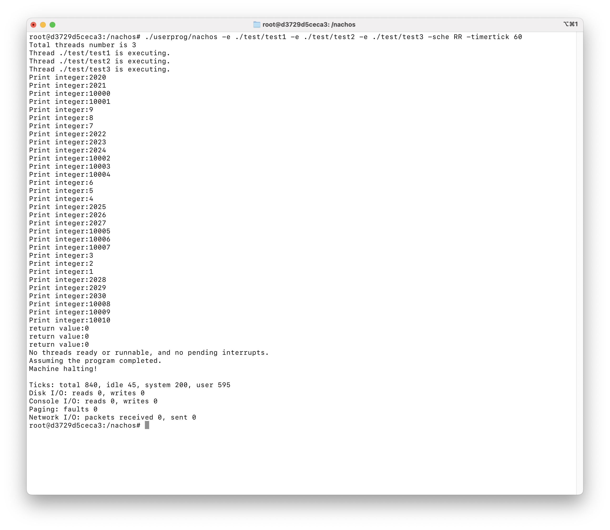
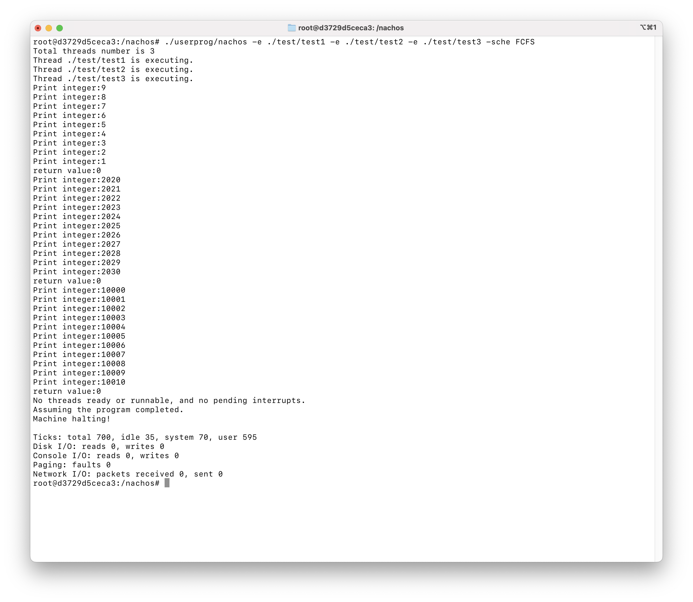
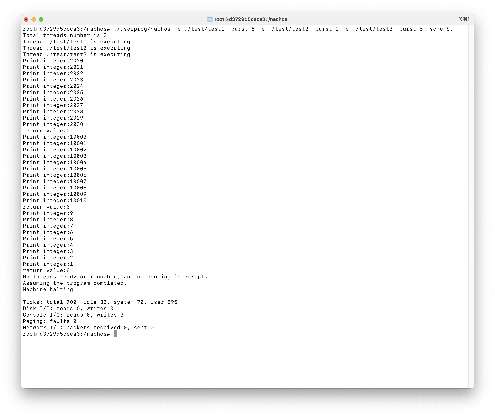
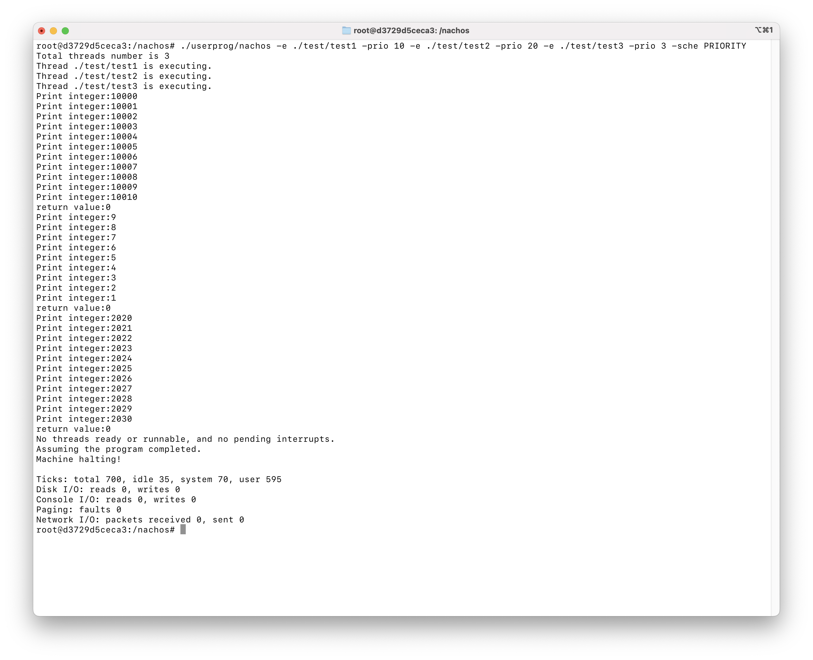
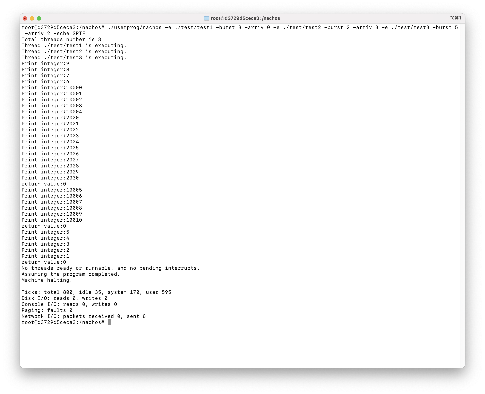

# Homework 02

> NTUST Course Project  
> Course No: `CS3009301`  
> Course Name: Operating Systems  
> Author: Hayden Chang 張皓鈞 B11030202  
> Email: B11030202@mail.ntust.edu.tw

## Description

This project use a fork version of NachOS to running in Docker.

For more information, please refer to the [repository](https://github.com/hayd1n/NachOS-Docker).


## Prerequisite for Running in Docker

> ⚠️ This project only support x86_64 architecture machine.

Running NachOS in Docker is the easiest way to get started.

### Install Docker

Install [Docker Engine](https://docs.docker.com/engine/install/) and [Compose Plugin](https://docs.docker.com/compose/install/linux/)

### Run Docker Image

Navigate to the `NachOS` directory.
Start the Docker container in the background.

```shell
cd NachOS
docker compose up -d
```

### Start a Shell in the Docker Container

```shell
docker exec -it nachos-docker-nachos-1 /bin/bash
```


## Prerequisite for Running on Ubuntu

> Support Ubuntu 22.04 LTS 64-bit

### Install Required Packages

#### Enable i386 architecture

```shell
sudo dpkg --add-architecture i386
```

#### Preform system upgrade

```shell
sudo apt update; sudo apt dist-upgrade
```

### Install the dependency (csh/git/compiler)

```shell
sudo apt install csh ed git build-essential gcc-multilib g++-multilib gdb gdb-
multiarch
```

### Install cross-compiler

Copy the cross-compiler to the system directory

```shell
sudo cp –r usr /
```


## Building NachOS

Enter the shell in the container first, then run `make` to build NachOS

```shell
make
```


## Goals

- [x] 🚩 [Scheduling Algorithm Flag](#Scheduling Algorithm Flag)
- [x] 🚩 [Timerticks Flag](#Timerticks Flag)
- [x] 🕒 [RR Scheduling](#RR Scheduling)
- [x] 🕒 [FCFS Scheduling](#FCFS Scheduling)
- [x] 🕒 [SJF Scheduling](#SJF Scheduling)
- [x] 🕒 [Priority Scheduling](#Priority Scheduling)
- [x] 🔥 [SRTF Scheduling](#SRTF Scheduling) (Bonus)


## Scheduling Algorithm Flag

Add `-sche` flag to support user selecting scheduling mode.

### Modified Files

#### threads/kernel.cc

Add flag parser.

```c++
ThreadedKernel::ThreadedKernel(int argc, char **argv) {
    randomSlice = FALSE;
    type = RR;

    for ( int i = 1; i < argc; i++ ) {
        if ( strcmp(argv[i], "-rs") == 0 ) {
            ASSERT(i + 1 < argc);
            RandomInit(atoi(argv[i + 1]));  // initialize pseudo-random
                                            // number generator
            randomSlice = TRUE;
            i++;
        } else if ( strcmp(argv[i], "-u") == 0 ) {
            cout << "Partial usage: nachos [-rs randomSeed]\n";
        } else if ( strcmp(argv[i], "-sche") == 0 ) {
            if ( !(i + 1 < argc) ) {
                cout << "Partial usage: nachos [-sche Schedluer Type]\n";
            } else if ( strcmp(argv[i + 1], "RR") == 0 ) {
                type = RR;
            } else if ( strcmp(argv[i + 1], "FCFS") == 0 ) {
                type = FIFO;
            } else if ( strcmp(argv[i + 1], "PRIORITY") == 0 ) {
                type = Priority;
            } else if ( strcmp(argv[i + 1], "SJF") == 0 ) {
                type = SJF;
            } else if ( strcmp(argv[i + 1], "SRTF") == 0 ) {
                type = SRTF;
            } else {
                cout
                    << "Partial usage: nachos [-sche Schedluer Type (RR/FCFS/PRIORITY/SJF/SRTF)]\n";
                Exit(1);
            }
        }
    }
}
```


## Timerticks Flag

Add `-timertick` flag to support user-defined timer ticks.

### Modified Files

#### threads/kernel.cc

Add flag parser.

```c++
ThreadedKernel::ThreadedKernel(int argc, char **argv) {
  	...
    for ( int i = 1; i < argc; i++ ) {
        ...
        } else if ( strcmp(argv[i], "-timertick") == 0 ) {
            if ( !(i + 1 < argc) ) {
                cout << "Partial usage: nachos [-timertick Timer Ticks]\n";
                Exit(1);
            } else {
                // set the timer ticks
                timerTicksVar = atoi(argv[i + 1]);
            }
        }
    }
}
```

#### machine/stats.h

Add a global variable for user-defined timer ticks.

```c++
const int UserTick = 1;        // advance for each user-level instruction
const int SystemTick = 10;     // advance each time interrupts are enabled
const int RotationTime = 500;  // time disk takes to rotate one sector
const int SeekTime = 500;      // time disk takes to seek past one track
const int ConsoleTime = 100;   // time to read or write one character
const int NetworkTime = 100;   // time to send or receive one packet
const int TimerTicks = 100;    // (average) time between timer interrupts

extern int timerTicksVar; // add this global variable for user-defined timer ticks
```

#### machine/stats.cc

```c++
int timerTicksVar = TimerTicks; // add this global variable for user-defined timer ticks
```

#### machine/timer.cc

Replace `TimerTicks` constant with `timerTicksVar` variable to support user-defined timer ticks.

```c++
void Timer::SetInterrupt() {
    if ( !disable ) {
        int delay = timerTicksVar;

        if ( randomize ) {
            delay = 1 + (RandomNumber() % (timerTicksVar * 2));
        }
        // schedule the next timer device interrupt
        kernel->interrupt->Schedule(this, delay, TimerInt);
    }
}
```


## RR Scheduling

RR scheduling is already implemented in the `hw2` base code, not much to do.

### Test Results

#### Timer Tick = `100`

Run the following command.

```
./userprog/nachos -e ./test/test1 -e ./test/test2 -e ./test/test3 -sche RR
```



#### Timer Tick = `60`

Run the following command.

```
./userprog/nachos -e ./test/test1 -e ./test/test2 -e ./test/test3 -sche RR -timertick 60
```




## FCFS Scheduling

For FCFS Scheduling only a simple FIFIO sorting algorithm needs to be implemented.

### Modified Files

#### threads/scheduler.cc

Add a FIFO compare function.

```c++
//----------------------------------------------------------------------
// FIFO Compare function
//----------------------------------------------------------------------
int FIFOCompare(Thread *a, Thread *b) { return 1; }
```

Add a case for FCFS(FIFO).

```c++
Scheduler::Scheduler(SchedulerType type) {
    schedulerType = type;
    switch ( schedulerType ) {
    ...
    case FIFO:
        readyList = new SortedList<Thread *>(FIFOCompare);
        break;
    }
    ...
}
```

### Test Result

Run the following command.

```
./userprog/nachos -e ./test/test1 -e ./test/test2 -e ./test/test3 -sche FCFS
```




## SJF Scheduling

For SJF scheduling we need to implement a `-burst` flag to set the burst value and an SJF sorting algorithm.

### Modified Files

#### userprog/userkernel.cc

Add `-burst` flag parser.

```c++
UserProgKernel::UserProgKernel(int argc, char **argv) : ThreadedKernel(argc, argv) {
    ...
    for ( int i = 1; i < argc; i++ ) {
        ...
        } else if ( strcmp(argv[i], "-burst") == 0 ) {
            if ( !(i + 1 < argc) ) {
                cout << "Partial usage: nachos [-e execFile] [-burst burstTime]\n";
            } else {
                try {
                    burstTimes[execfileNum] = atoi(argv[i + 1]);
                } catch ( ... ) {
                    cout << "Error: burst time should be a number." << endl;
                    Exit(1);
                }
            }
    		}
    }
}
```

Set burst value for threads.

```c++
void UserProgKernel::Run() {
    cout << "Total threads number is " << execfileNum << endl;
    for ( int n = 1; n <= execfileNum; n++ ) {
        t[n] = new Thread(execfile[n]);

        // Set burst time for each thread
        t[n]->setBurstTime(burstTimes[n]);

        t[n]->space = new AddrSpace();
        t[n]->Fork((VoidFunctionPtr)&ForkExecute, (void *)t[n]);
        cout << "Thread " << execfile[n] << " is executing." << endl;
    }
}
```

#### threads/scheduler.cc

Add a SJF compare function.

```c++
//----------------------------------------------------------------------
// SJF Compare function
//----------------------------------------------------------------------
int SJFCompare(Thread *a, Thread *b) {
    if ( a->getBurstTime() == b->getBurstTime() )
        return 0;
    return a->getBurstTime() > b->getBurstTime() ? 1 : -1;
}
```

Add a case for SJF.

```c++
Scheduler::Scheduler(SchedulerType type) {
    schedulerType = type;
    switch ( schedulerType ) {
    ...
    case SJF:
        readyList = new SortedList<Thread *>(SJFCompare);
        break;
    }
    ...
}
```

### Test Result

Run the following command.

```
./userprog/nachos -e ./test/test1 -burst 8 -e ./test/test2 -burst 2 -e ./test/test3 -burst 5 -sche SJF
```




## Priority Scheduling

Priority scheduling is inherently similar to SJF, so all that is needed is to implement a `-prio` for setting the priority value, and a sorting algorithm.

### Modified Files

#### userprog/userkernel.cc

Add `-prio` flag parser.

```c++
UserProgKernel::UserProgKernel(int argc, char **argv) : ThreadedKernel(argc, argv) {
    ...
    for ( int i = 1; i < argc; i++ ) {
        ...
        } else if ( strcmp(argv[i], "-prio") == 0 ) {
            if ( !(i + 1 < argc) ) {
                cout << "Partial usage: nachos [-e execFile] [-prio priority]\n";
            } else {
                try {
                    priority[execfileNum] = atoi(argv[i + 1]);
                } catch ( ... ) {
                    cout << "Error: priority should be a number." << endl;
                    Exit(1);
                }
            }
        }
    }
}
```

Set priority value for threads.

```c++
void UserProgKernel::Run() {
    cout << "Total threads number is " << execfileNum << endl;
    for ( int n = 1; n <= execfileNum; n++ ) {
        t[n] = new Thread(execfile[n]);

        ...

        // Set priority for each thread
        t[n]->setPriority(priority[n]);

        t[n]->space = new AddrSpace();
        t[n]->Fork((VoidFunctionPtr)&ForkExecute, (void *)t[n]);
        cout << "Thread " << execfile[n] << " is executing." << endl;
    }
```

#### threads/scheduler.cc

Add a priority compare function.

```c++
//----------------------------------------------------------------------
// Compare function
//----------------------------------------------------------------------
int PriorityCompare(Thread *a, Thread *b) {
    if ( a->getPriority() == b->getPriority() )
        return 0;
    return a->getPriority() > b->getPriority() ? 1 : -1;
}
```

Add a case for priority.

```c++
Scheduler::Scheduler(SchedulerType type) {
    schedulerType = type;
    switch ( schedulerType ) {
    ...
    case Priority:
        readyList = new SortedList<Thread *>(PriorityCompare);
        break;
    }
    ...
}
```

#### threads/alarm.cc

Since we don't want to switch threads during priority scheduling, we remove “yield on return” for priority scheduling.

```c++
void Alarm::CallBack() {
    ...
    if ( status == IdleMode && !woken && sleeper.isEmpty() ) {  // is it time to quit?
        if ( !interrupt->AnyFutureInterrupts() ) {
            timer->Disable();  // turn off the timer
        }
    } else {  // there's someone to preempt
        if ( kernel->scheduler->getSchedulerType() == RR ) {
            // remove `kernel->scheduler->getSchedulerType() == Priority` conditional
            interrupt->YieldOnReturn();
        }
    }
}
```

### Test Result

Run the following command.

```
./userprog/nachos -e ./test/test1 -prio 10 -e ./test/test2 -prio 20 -e ./test/test3 -prio 3 -sche PRIORITY
```




## SRTF Scheduling

SRTF scheduling is essentially the same as SJF scheduling, except for the additional preemption mechanism.

### Modified Files

#### userprog/userkernel.cc

Add `-arriv` flag parser to set threads arrive time.

```c++
UserProgKernel::UserProgKernel(int argc, char **argv) : ThreadedKernel(argc, argv) {
    ...
    for ( int i = 1; i < argc; i++ ) {
        ...
        } else if ( strcmp(argv[i], "-arriv") == 0 ) {
            if ( !(i + 1 < argc) ) {
                cout << "Partial usage: nachos [-e execFile] [-arriv arriveTime]\n";
            } else {
                try {
                    arriveTime[execfileNum] = atoi(argv[i + 1]);
                } catch ( ... ) {
                    cout << "Error: arrive time should be a number." << endl;
                    Exit(1);
                }
            }
        }
    }
}
```

Make the thread sleep immediately after the fork until arrow time.

```c++
void UserProgKernel::Run() {
    cout << "Total threads number is " << execfileNum << endl;
    for ( int n = 1; n <= execfileNum; n++ ) {
        t[n] = new Thread(execfile[n]);

        // Set burst time for each thread
        t[n]->setBurstTime(burstTimes[n]);

        t[n]->space = new AddrSpace();
        t[n]->Fork((VoidFunctionPtr)&ForkExecute, (void *)t[n]);
        // Sleep for SRTF
        if ( kernel->scheduler->getSchedulerType() == SRTF ) {
            kernel->alarm->sleeper.napTime(t[n], arriveTime[n]);
        }
        cout << "Thread " << execfile[n] << " is executing." << endl;
    }
```

#### threads/scheduler.cc

Sorting algorithm consistent with SJF.

```c++
Scheduler::Scheduler(SchedulerType type) {
    schedulerType = type;
    switch ( schedulerType ) {
    ...
    case SJF:
    case SRTF:
        readyList = new SortedList<Thread *>(SJFCompare);
        break;
    }
    ...
}
```

Saves the previous interrupt status and restores it after the operation is finished.

```c++
void Sleeper::napTime(Thread *t, int x) {
    // Save the current interrupt status
    IntStatus oldLevel = kernel->interrupt->SetLevel(IntOff);

    ASSERT(kernel->interrupt->getLevel() == IntOff);
    DEBUG(dbgThread, "Putting thread to sleep: " << t->getName() << " for " << x);
    tList.push_back(SleepT(t, currentINT + x));
    if ( kernel->scheduler->getSchedulerType() != SRTF ) {
        t->Sleep(false);
    }

    // Restore the interrupt status
    kernel->interrupt->SetLevel(oldLevel);
}
```

```c++
bool Sleeper::wakeUp() {
    // Save the current interrupt status
    IntStatus oldLevel = kernel->interrupt->SetLevel(IntOff);

    bool woken = false;
    currentINT++;

    for ( std::list<SleepT>::iterator it = tList.begin(); it != tList.end(); ) {
        if ( currentINT >= it->when ) {
            it->thread->setStatus(READY);
            kernel->scheduler->ReadyToRun(it->thread);
            it = tList.erase(it);
            woken = true;
        } else {
            it++;
        }
    }

    if ( woken ) {
        DEBUG(dbgThread, "Woken up threads");
    }

    // Restore the interrupt status
    kernel->interrupt->SetLevel(oldLevel);

    return woken;
}
```

#### threads/thread.cc

Modify the yield method to switch threads correctly.

```c++
void Thread::Yield() {
    Thread *nextThread;
    IntStatus oldLevel = kernel->interrupt->SetLevel(IntOff);

    ASSERT(this == kernel->currentThread);

    DEBUG(dbgThread, "Yielding thread: " << name);

    nextThread = kernel->scheduler->FindNextToRun();
    if ( nextThread != NULL ) {
        // Because it's preemtive, each yield has to determine whether it will be 
      	// interrupted or not.
        // It's possible that it won't be interrupted, so you can't just throw nextThread 
      	// into ReadyToRun like other scheduling methods.
        if ( kernel->scheduler->getSchedulerType() == SRTF ) {
            if ( nextThread->getBurstTime() < this->getBurstTime() ) {
                kernel->scheduler->ReadyToRun(this);
                kernel->scheduler->Run(nextThread, FALSE);
            } else {
                kernel->scheduler->ReadyToRun(nextThread);
            }
        } else {
            kernel->scheduler->ReadyToRun(this);
            kernel->scheduler->Run(nextThread, FALSE);
        }
    }
    (void)kernel->interrupt->SetLevel(oldLevel);
}
```

#### threads/alarm.cc

For SRTF, it is necessary to yield on return.

```c++
void Alarm::CallBack() {
    Interrupt *interrupt = kernel->interrupt;
    MachineStatus status = interrupt->getStatus();

    kernel->currentThread->setPriority(kernel->currentThread->getPriority() - 1);

    // this line is add for systemcall sleep
    bool woken = sleeper.wakeUp();

    if ( status == IdleMode && !woken && sleeper.isEmpty() ) {  // is it time to quit?
        if ( !interrupt->AnyFutureInterrupts() ) {
            timer->Disable();  // turn off the timer
        }
    } else {  // there's someone to preempt
        if ( kernel->scheduler->getSchedulerType() == RR ||
             kernel->scheduler->getSchedulerType() == SRTF ) {
            interrupt->YieldOnReturn();
        }
    }
}
```

### Test Results

#### Timer Ticks = `100`

Run the following command.

```
./userprog/nachos -e ./test/test1 -burst 8 -arriv 0 -e ./test/test2 -burst 2 -arriv 3 -e ./test/test3 -burst 5 -arriv 2 -sche SRTF
```



#### Timer Ticks = `20`

Run the following command.

```
./userprog/nachos -e ./test/test1 -burst 8 -arriv 0 -e ./test/test2 -burst 2 -arriv 25 -e ./test/test3 -burst 5 -arriv 15 -sche SRTF -timertick 20
```


