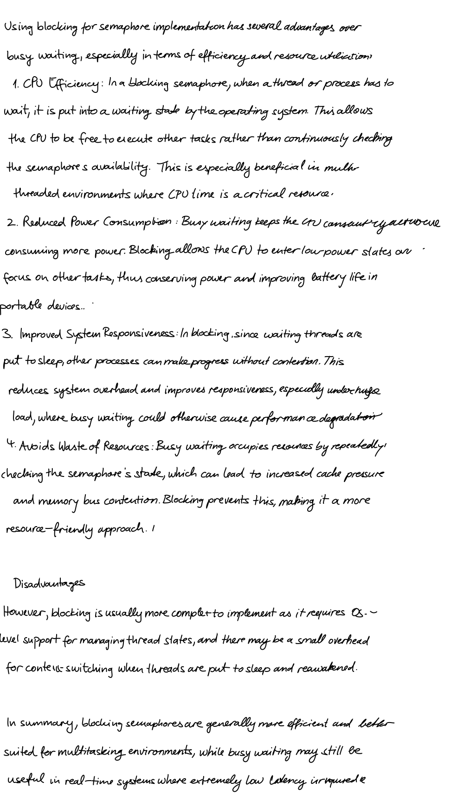

# Homework 03

> NTUST Course Project  
> Course No: `CS3009301`  
> Course Name: Operating Systems  
> Author: Hayden Chang 張皓鈞 B11030202  
> Email: B11030202@mail.ntust.edu.tw


## Why the original `test_and_set` program does not satisfy bounded waiting? (15%)


## Please write down a C code for `compare_and_swap` with mutual exclusion and bounded-waiting and explain why (30%)

```c
do {
    waiting[i] = true;
    key = 1;
    while(key == 1 && waiting[i]) {
        key = compare_and_swap(&lock, 0, 1);
    }
    waiting[i] = false;
    
    // critical section
    
    j = (i + 1) & n;
    while((j != i) && !waiting[j]) {
        j = (j + 1) % n;
    }
    if(j == i) {
        lock = 0;
    } else {
        waiting[j] = false;
    }
    
    // remainder section
    
} while(true);
```


## Regarding Bakery algorithm, please answer following questions (25%)

```c
do {
  Choosing[i] = TRUE;
  Number[i] = Max(Number[0],…Number[n - 1]) + 1;
  Choosing[i] = FALSE;
  for (j = 0; j < n; j++) {
    while (Choosing[j]);
    while ((Number[j] != 0) && ((Number[j], j) < (Number[i], i)));
  }

  // critical section

  Number[i] = 0

  // remainder section

} while (TRUE);
```

- Is it possible that many processes receive the same number?
- If we remove the first while loop (i.e. `while(Choosing[j]);`), the mutual exclusion is still maintained?
- Please prove the correctness of Bakery algorithm in terms of mutual exclusion, progress, and bounded waiting.


## What’s the advantages of semaphore implemented using blocking than using busy waiting? (10%)




## Please explain the advantages and disadvantages of semaphore and monitor in the same problem. (10%)


## Regarding following Bounded Buffer Problem, please answer following questions (10%)

### Producer

```c
do {
  // produce an item in nextp
  wait(mutex);
  wait(empty);
  // add the item to the buffer
  signal(full);
  signal(mutex);
} while (TRUE);
```

### Comusmer

```c
do {
  wait(full);
  wait(mutex);
  // remove an item from buffer to nextc
  signal(mutex);
  signal(empty);
  // consume the item in nextc
} while (TRUE);
```

- Is there any problem in this version of Bounded Buffer Problem? How to correct the mistakes?


### Revised Producer

```c
do {
  // produce an item in nextp
  wait(empty);
  wait(mutex);
  // add the item to the buffer
  signal(mutex);
  signal(full);
} while (TRUE);
```

