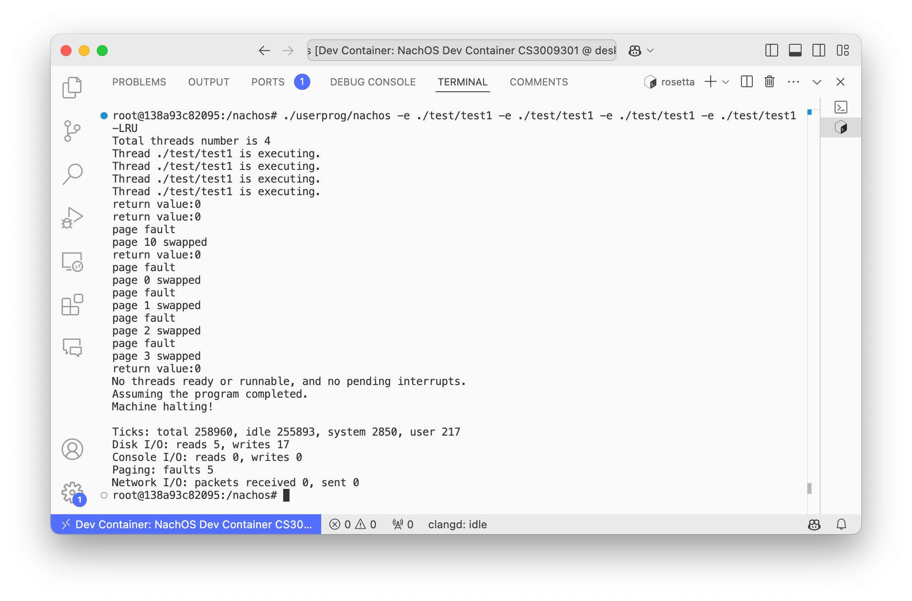

# Homework 04

> NTUST Course Project  
> Course No: `CS3009301`  
> Course Name: Operating Systems  
> Author: Hayden Chang 張皓鈞 B11030202, Allen Cheng 鄭健廷 B11130225, LuYee 呂學易 B11130233
> Email: [B11030202@mail.ntust.edu.tw](mailto:B11030202@mail.ntust.edu.tw), [B11130225@mail.ntust.edu.tw](mailto:B11130225@mail.ntust.edu.tw), [B11130233@mail.ntust.edu.tw](mailto:B11130233@mail.ntust.edu.tw)

## Description

This project use a fork version of NachOS to running in Docker.

For more information, please refer to the [repository](https://github.com/hayd1n/NachOS-Docker).

## Prerequisite for Running in Docker

> ⚠️ This project only support x86_64 architecture machine.

Running NachOS in Docker is the easiest way to get started.

### Install Docker

Install [Docker Engine](https://docs.docker.com/engine/install/) and [Compose Plugin](https://docs.docker.com/compose/install/linux/)

### Run Docker Image

Navigate to the `NachOS` directory.
Start the Docker container in the background.

```shell
cd NachOS
docker compose up -d
```

### Start a Shell in the Docker Container

```shell
docker exec -it nachos-docker-nachos-1 /bin/bash
```

## Prerequisite for Running on Ubuntu

> Support Ubuntu 22.04 LTS 64-bit

### Install Required Packages

#### Enable i386 architecture

```shell
sudo dpkg --add-architecture i386
```

#### Preform system upgrade

```shell
sudo apt update; sudo apt dist-upgrade
```

### Install the dependency (csh/git/compiler)

```shell
sudo apt install csh ed git build-essential gcc-multilib g++-multilib gdb gdb-
multiarch
```

### Install cross-compiler

Copy the cross-compiler to the system directory

```shell
sudo cp –r usr /
```

## Building NachOS

Enter the shell in the container first, then run `make` to build NachOS

```shell
make
```

## Goals

- [x] 📑 [Implement virtual memory capable of handling page faults](#implement-virtual-memory-capable-of-handling-page-faults)
- [x] 📑 [Implement the page replacement algorithm](#implement-the-page-replacement-algorithm)
  - [x] 📃 First in First out Page Replacement (FIFO)
  - [x] 📃 Least Recently Used Page Replacement (LRU)

## Implement virtual memory capable of handling page faults

Add `-FIFO` `-LRU` flag to support user selecting scheduling mode.

Verify the results using a test program. Declare a sufficiently large int array and perform some operations on the array.

### Modified Files

#### userprog/userkernel.h

Using SynchDisk as secondary memory.

Add `pageReplacementType` for switching LRU and FIFO.

```c++
// userkernel.h
enum class PageReplacementType { FIFO, LRU };

class SynchDisk;

class UserProgKernel : public ThreadedKernel {
public:
    UserProgKernel(int argc, char **argv);
    // Interpret command line arguments
    ~UserProgKernel();  // deallocate the kernel

    void Initialize();  // initialize the kernel

    void Run();  // do kernel stuff

    void SelfTest();  // test whether kernel is working

    // These are public for notational convenience.
    Machine *machine;
    FileSystem *fileSystem;
    SynchDisk *virtualMemoryDisk;

    PageReplacementType pageReplacementType;

#ifdef FILESYS
    SynchDisk *synchDisk;
#endif  // FILESYS

private:
    bool debugUserProg;  // single step user program
    Thread *t[10];
    char *execfile[10];
    int execfileNum;
};

#endif  // USERKERNEL_H
```

#### userprog/userkernel.cc

Add SynchDisk in init.

Implement scheduling algorithm flag.

```c++
UserProgKernel::UserProgKernel(int argc, char **argv) : ThreadedKernel(argc, argv) {
    debugUserProg = FALSE;
    execfileNum = 0;
    pageReplacementType = PageReplacementType::FIFO;
    for ( int i = 1; i < argc; i++ ) {
        if ( strcmp(argv[i], "-s") == 0 ) {
            debugUserProg = TRUE;
        } else if ( strcmp(argv[i], "-e") == 0 ) {
            execfile[++execfileNum] = argv[i + 1];
        } else if ( strcmp(argv[i], "-u") == 0 ) {
            cout << "===========The following argument is defined in userkernel.cc" << endl;
            cout << "Partial usage: nachos [-s]\n";
            cout << "Partial usage: nachos [-u]" << endl;
            cout << "Partial usage: nachos [-e] filename" << endl;
        } else if ( strcmp(argv[i], "-h") == 0 ) {
            cout << "argument 's' is for debugging. Machine status  will be printed " << endl;
            cout << "argument 'e' is for execting file." << endl;
            cout << "atgument 'u' will print all argument usage." << endl;
            cout << "For example:" << endl;
            cout << "	./nachos -s : Print machine status during the machine is on." << endl;
            cout << "	./nachos -e file1 -e file2 : executing file1 and file2." << endl;
        } else if ( strcmp(argv[i], "-FIFO") == 0 ) {
            pageReplacementType = PageReplacementType::FIFO;
        } else if ( strcmp(argv[i], "-LRU") == 0 ) {
            pageReplacementType = PageReplacementType::LRU;
        }
    }
}

void UserProgKernel::Initialize() {
    ThreadedKernel::Initialize();  // init multithreading

    machine = new Machine(debugUserProg);
    fileSystem = new FileSystem();
    virtualMemoryDisk = new SynchDisk("vm_disk");
#ifdef FILESYS
    synchDisk = new SynchDisk("New SynchDisk");
#endif  // FILESYS
}
```

#### machine/machine.h & machine/machine.cc

Add variable that will be use. And implement functions to find unused physical page and virtual page.

```c++
// machine.h
const unsigned int NumVirtPages = NumPhysPages;

int idNum;
    bool usedPhysPage[NumPhysPages];  // record that the physical memory has been used
    bool usedVirtPage[NumVirtPages];  // record that virtual memory has been used
    int phyPageId[NumPhysPages];
    int count[NumPhysPages];  // counter for LRU

    TranslationEntry *mainTab[NumPhysPages];
    static int fifoCount;
    static int totalCount;

    // Find a physical page that is not used
    // -1: no available physical page
    int findUnusedPhysPage();

    // Find a virtual page that is not used
    // -1: no available virtual page
    int findUnusedVirtPage();
```

```c++
// machine.cc
int Machine::fifoCount = 0;
int Machine::totalCount = 0;

int Machine::findUnusedPhysPage() {
    for ( int i = 0; i < NumPhysPages; i++ ) {
        if ( usedPhysPage[i] == false )
            return i;
    }
    return -1;
}

int Machine::findUnusedVirtPage() {
    for ( int i = 0; i < NumVirtPages; i++ ) {
        if ( usedVirtPage[i] == false )
            return i;
    }
    return -1;
}
```


#### userprog/addrspace.cc

Open a page table dedicated to this thread here in Load, and when loading, keep looking down for memory until you find one that isn't being used or until the end of the day, in order to determine if the memory is enough, and if it isn't, then you need to use auxiliary memory, and you need to store some important parameters so that you can find them when you want to use them.

```c++
AddrSpace::AddrSpace() {
    // assign a unique id to each thread
    kernel->machine->idNum += 1;
    id = kernel->machine->idNum;

    // Create and initialize the page table
    pageTable = new TranslationEntry[NumPhysPages];
    for ( unsigned int i = 0; i < NumPhysPages; i++ ) {
        pageTable[i].virtualPage = i;  // for now, virt page # = phys page #
        pageTable[i].physicalPage = i;
        pageTable[i].valid = true;
        pageTable[i].use = false;
        pageTable[i].dirty = false;
        pageTable[i].readOnly = false;
        pageTable[i].count = 0;
    }

    // zero out the entire address space
    //    bzero(kernel->machine->mainMemory, MemorySize);
}

AddrSpace::~AddrSpace() {
    // for ( int i = 0; i < numPages; i++ ) AddrSpace::usedPhyPage[pageTable[i].physicalPage] =
    // false;
    delete pageTable;
}

bool AddrSpace::Load(char *fileName) {
    OpenFile *executable = kernel->fileSystem->Open(fileName);
    NoffHeader noffH;
    unsigned int size;

    if ( executable == NULL ) {
        cerr << "Unable to open file " << fileName << "\n";
        return FALSE;
    }
    executable->ReadAt((char *)&noffH, sizeof(noffH), 0);
    if ( (noffH.noffMagic != NOFFMAGIC) && (WordToHost(noffH.noffMagic) == NOFFMAGIC) )
        SwapHeader(&noffH);
    ASSERT(noffH.noffMagic == NOFFMAGIC);

    // how big is address space?
    size = noffH.code.size + noffH.initData.size + noffH.uninitData.size +
           UserStackSize;  // we need to increase the size
                           // to leave room for the stack
    numPages = divRoundUp(size, PageSize);
    //	cout << "number of pages of " << fileName<< " is "<<numPages<<endl;
    size = numPages * PageSize;

    numPages = divRoundUp(size, PageSize);

    size = numPages * PageSize;

    // ASSERT(numPages <= NumPhysPages);  // check we're not trying
    //                                    // to run anything too big --
    //                                    // at least until we have
    //                                    // virtual memory

    // DEBUG(dbgAddr, "Initializing address space: " << numPages << ", " << size);

    // then, copy in the code and data segments into memory
    if ( noffH.code.size > 0 ) {
        DEBUG(dbgAddr, "Initializing code segment.");
        DEBUG(dbgAddr, noffH.code.virtualAddr << ", " << noffH.code.size);
        for ( unsigned int i = 0; i < numPages; i++ ) {
            int avaliable = kernel->machine->findUnusedPhysPage();

            // If you find one that has not been used, it means that there is enough memory, so you
            // can use it directly.
            if ( avaliable != -1 ) {
                // printf("use physical page %d\n", avaliable);

                kernel->machine->usedPhysPage[avaliable] = true;
                kernel->machine->phyPageId[avaliable] = id;
                kernel->machine->mainTab[avaliable] = &pageTable[i];
                pageTable[i].physicalPage = avaliable;
                pageTable[i].valid = true;
                pageTable[i].use = false;
                pageTable[i].dirty = false;
                pageTable[i].readOnly = false;
                pageTable[i].id = id;
                kernel->machine->totalCount += 1;
                pageTable[i].count = kernel->machine->totalCount;
                executable->ReadAt(&(kernel->machine->mainMemory[avaliable * PageSize]), PageSize,
                                   noffH.code.inFileAddr + (i * PageSize));
            } else {
                // If you can't find it, it means the memory is not enough and you need to use
                // virtual memory.
                char buffer[PageSize];

                int avaliable = kernel->machine->findUnusedVirtPage();
                if ( avaliable == -1 ) {
                    avaliable = NumPhysPages;
                }

                // printf("use physical page %d\n", avaliable);

                kernel->machine->usedVirtPage[avaliable] = true;
                pageTable[i].virtualPage = avaliable;  // Save the virtual page used
                pageTable[i].valid = false;  // It means he's not really in the main memory
                pageTable[i].use = false;
                pageTable[i].dirty = false;
                pageTable[i].readOnly = false;
                pageTable[i].id = id;
                executable->ReadAt(buffer, PageSize, noffH.code.inFileAddr + (i * PageSize));
                kernel->virtualMemoryDisk->WriteSector(avaliable,
                                                       buffer);  // Write the contents to disk
            }
        }
    }
    if ( noffH.initData.size > 0 ) {
        DEBUG(dbgAddr, "Initializing data segment.");
        DEBUG(dbgAddr, noffH.initData.virtualAddr << ", " << noffH.initData.size);
        executable->ReadAt(&(kernel->machine->mainMemory[noffH.initData.virtualAddr]),
                           noffH.initData.size, noffH.initData.inFileAddr);
    }

    delete executable;  // close file
    return TRUE;        // success
}

void AddrSpace::Execute(char *fileName) {
    pageTableLoaded = false;
    if ( !Load(fileName) ) {
        cout << "inside !Load(FileName)" << endl;
        return;  // executable not found
    }

    // kernel->currentThread->space = this;
    this->InitRegisters();  // set the initial register values
    this->RestoreState();   // load page table register

    pageTableLoaded = true;
    kernel->machine->Run();  // jump to the user progam

    ASSERTNOTREACHED();  // machine->Run never returns;
                         // the address space exits
                         // by doing the syscall "exit"
}

void AddrSpace::SaveState() {
    if ( pageTableLoaded ) {
        pageTable = kernel->machine->pageTable;
        numPages = kernel->machine->pageTableSize;
    }
}
```

## Implement the page replacement algorithm

- First in First out Page Replacement (FIFO)
- Least Recently Used Page Replacement (LRU)

### Modified Files

#### machine/translate.cc

The main thing is to change `else if (!pageTable[vpn].valid)`.

FIFO is always in order when victim, LRU uses a count to count the number of times it has been used.

LRU uses a totalcount to update, every time a physical page is accessed, it will be added up to update, and update the physical page.

LRU is to use a count to count the number of times it has been used, the count used by LRU is updated with a totalcount, every time a physical page is accessed, it will be updated upwards, and the count of the page being accessed will be updated, when looking for a victim page, choose the one with the lowest count, that is, the one that has not been accessed for the longest time. When looking for a victim page, choose the one with the lowest count, that is, the one that has not been accessed for the longest time. After finding the victim, you can then swap in swap out.

```c++
ExceptionType Machine::Translate(int virtAddr, int *physAddr, int size, bool writing) {
    int i;
    unsigned int vpn, offset;
    TranslationEntry *entry;
    unsigned int pageFrame;

    DEBUG(dbgAddr, "\tTranslate " << virtAddr << (writing ? " , write" : " , read"));

    // check for alignment errors
    if ( ((size == 4) && (virtAddr & 0x3)) || ((size == 2) && (virtAddr & 0x1)) ) {
        DEBUG(dbgAddr, "Alignment problem at " << virtAddr << ", size " << size);
        return AddressErrorException;
    }

    // we must have either a TLB or a page table, but not both!
    ASSERT(tlb == NULL || pageTable == NULL);
    ASSERT(tlb != NULL || pageTable != NULL);

    // calculate the virtual page number, and offset within the page,
    // from the virtual address
    vpn = (unsigned)virtAddr / PageSize;
    offset = (unsigned)virtAddr % PageSize;

    if ( tlb == NULL ) {  // => page table => vpn is index into table
        if ( vpn >= pageTableSize ) {
            DEBUG(dbgAddr, "Illegal virtual page # " << virtAddr);
            return AddressErrorException;
        } else if ( !pageTable[vpn].valid ) {
            // Page fault
            printf("page fault\n");

            kernel->stats->numPageFaults++;

            totalCount += 1;
            int available = kernel->machine->findUnusedPhysPage();

            if ( available != -1 ) {
                char buffer[PageSize];
                kernel->machine->usedPhysPage[available] = true;
                kernel->machine->phyPageId[available] = pageTable[vpn].id;

                kernel->machine->mainTab[available] = &pageTable[vpn];
                pageTable[vpn].physicalPage = available;
                pageTable[vpn].valid = true;
                pageTable[vpn].count = totalCount;  // for LRU

                kernel->virtualMemoryDisk->ReadSector(pageTable[vpn].virtualPage, buffer);
                bcopy(buffer, &mainMemory[available * PageSize], PageSize);
            } else {
                char buffer1[PageSize];
                char buffer2[PageSize];

                int victim;

                // FIFO
                if ( kernel->pageReplacementType == PageReplacementType::FIFO ) {
                    victim = fifoCount % NumPhysPages;
                }

                // LRU
                if ( kernel->pageReplacementType == PageReplacementType::LRU ) {
                    int min = pageTable[0].count;
                    victim = 0;
                    for ( int i = 0; i < NumPhysPages; i++ ) {
                        // printf("pageTable[%d].count: %d\n", i, pageTable[i].count);
                        if ( min > pageTable[i].count ) {
                            min = pageTable[i].count;
                            victim = i;
                        }
                    }
                    totalCount += 1;
                    pageTable[victim].count = totalCount;
                }

                printf("page %d swapped\n", victim);

                // Write the contents to disk
                bcopy(&mainMemory[victim * PageSize], buffer1, PageSize);
                kernel->virtualMemoryDisk->ReadSector(pageTable[vpn].virtualPage, buffer2);
                bcopy(buffer2, &mainMemory[victim * PageSize], PageSize);
                kernel->virtualMemoryDisk->WriteSector(pageTable[vpn].virtualPage, buffer1);

                mainTab[victim]->virtualPage = pageTable[vpn].virtualPage;
                mainTab[victim]->valid = false;

                // Load contents into main memory
                pageTable[vpn].valid = true;
                pageTable[vpn].physicalPage = victim;
                kernel->machine->phyPageId[victim] = pageTable[vpn].id;
                mainTab[victim] = &pageTable[vpn];
                fifoCount += 1;
            }
        }
        entry = &pageTable[vpn];
    } else {
        for ( entry = NULL, i = 0; i < TLBSize; i++ )
            if ( tlb[i].valid && (tlb[i].virtualPage == vpn) ) {
                entry = &tlb[i];  // FOUND!
                break;
            }
        if ( entry == NULL ) {  // not found
            DEBUG(dbgAddr, "Invalid TLB entry for this virtual page!");
            return PageFaultException;  // really, this is a TLB fault,
                                        // the page may be in memory,
                                        // but not in the TLB
        }
    }

    if ( entry->readOnly && writing ) {  // trying to write to a read-only page
        DEBUG(dbgAddr, "Write to read-only page at " << virtAddr);
        return ReadOnlyException;
    }
    pageFrame = entry->physicalPage;

    // if the pageFrame is too big, there is something really wrong!
    // An invalid translation was loaded into the page table or TLB.
    if ( pageFrame >= NumPhysPages ) {
        DEBUG(dbgAddr, "Illegal pageframe " << pageFrame);
        return BusErrorException;
    }
    entry->use = TRUE;  // set the use, dirty bits
    if ( writing )
        entry->dirty = TRUE;
    *physAddr = pageFrame * PageSize + offset;
    ASSERT((*physAddr >= 0) && ((*physAddr + size) <= MemorySize));
    DEBUG(dbgAddr, "phys addr = " << *physAddr);
    return NoException;
}
```

## Test Result

### FIFO

Run the following command.

````
./userprog/nachos -e ./test/test1 -e ./test/test1 -e ./test/test1 -e ./test/test1 -FIFO
````


### LRU

Run the following command.

```
./userprog/nachos -e ./test/test1 -e ./test/test1 -e ./test/test1 -e ./test/test1 -LRU
```



## Contribution

- Hayden Chang 張皓鈞 B11030202: 40%
- Allen Cheng 鄭健廷 B11130225: 30%
- LuYee 呂學易 B11130233: 30%
