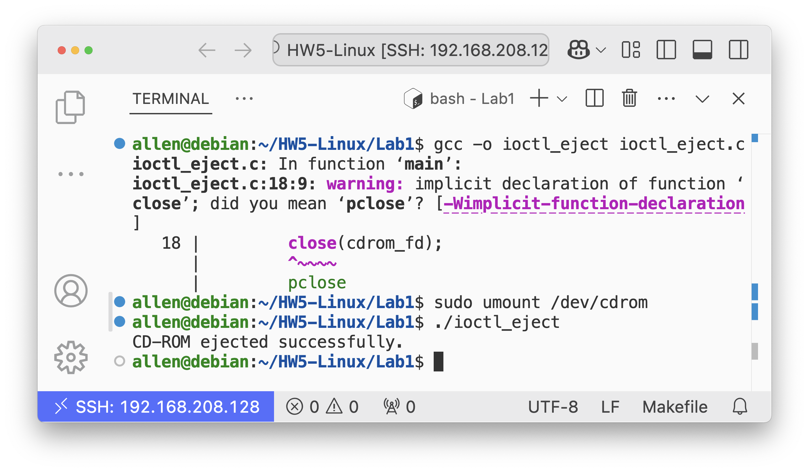
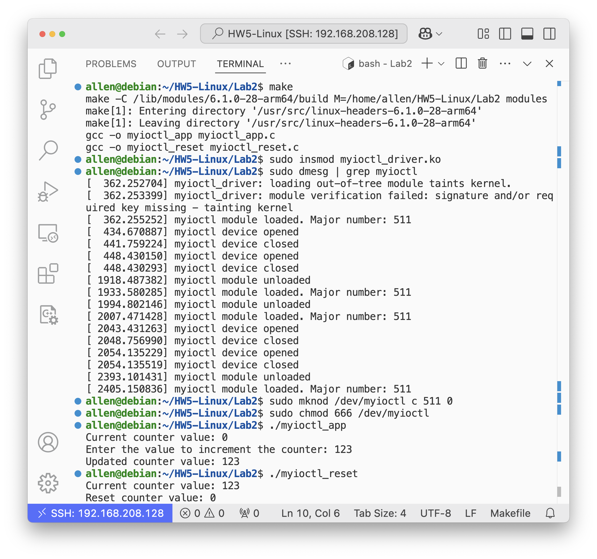
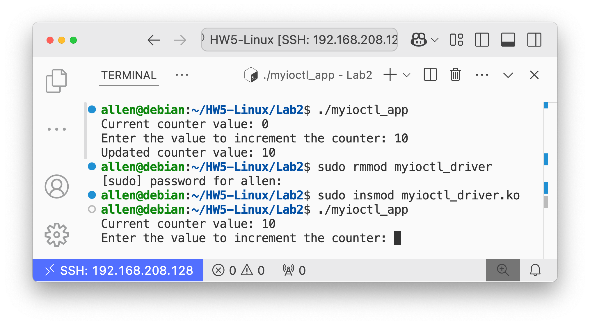

# Homework 05

> NTUST Course Project  
> Course No: `CS3009301`  
> Course Name: Operating Systems  
> Author: Hayden Chang 張皓鈞 B11030202, Allen Cheng 鄭健廷 B11130225, LuYee 呂學易 B11130233  
> Email: [B11030202@mail.ntust.edu.tw](mailto:B11030202@mail.ntust.edu.tw),  [B11130225@mail.ntust.edu.tw](mailto:B11130225@mail.ntust.edu.tw),  [B11130233@mail.ntust.edu.tw](mailto:B11130233@mail.ntust.edu.tw)

## Goals

- [x] 💿 Ejecing CD-ROM via IOCTL
- [x] 🚗 Linux Kernel Driver
- [x] 🏎️ Linux Kernel Driver (EXT) - Reset Counter Value
- [x] 🔥 Bonus: IOCTL Related Project

## Lab1

This program unlocks and ejects the CD-ROM tray on a Linux system by opening the CD-ROM device (`/dev/cdrom`) and using ioctl system calls. It ensures proper error handling for device access, unlocking, and ejection, and closes the device file descriptor after the operation.

### Description

1. Opens the CD-ROM device located at `/dev/cdrom` in read-only mode.
2. Unlocks the CD-ROM door to allow ejection.
3. Ejects the CD-ROM tray.
4. Closes the file descriptor for the CD-ROM device.

5. If any step fails (e.g., the device cannot be opened or an operation fails), the program displays an error message and exits with a failure status.

#### ioctl_eject.c

```c
#include <fcntl.h>
#include <linux/cdrom.h>
#include <stdio.h>
#include <stdlib.h>
#include <sys/ioctl.h>

int main() {
    // Open the CD-ROM device
    int cdrom_fd = open("/dev/cdrom", O_RDONLY);
    if ( cdrom_fd == -1 ) {
        perror("Error opening CD-ROM device");
        exit(EXIT_FAILURE);
    }

    // Unlock the CD-ROM door
    if ( ioctl(cdrom_fd, CDROM_LOCKDOOR, 0) == -1 ) {
        perror("Error unlocking CD-ROM door");
        close(cdrom_fd);
        exit(EXIT_FAILURE);
    }

    // Eject the CD-ROM
    if ( ioctl(cdrom_fd, CDROMEJECT, 0) == -1 ) {
        perror("Error ejecting CD-ROM");
        close(cdrom_fd);
        exit(EXIT_FAILURE);
    }
    printf("CD-ROM ejected successfully.\n");

    // Close the CD-ROM device
    close(cdrom_fd);

    return 0;
}
```

### Build

```bash
gcc -o ioctl_eject ioctl_eject.c
```

### Run

```bash
sudo umount /dev/cdrom
./ioctl_eject
```

### Test Result



## Lab2(With EXT)

This program demonstrates a simple Linux kernel module (`myioctl_driver.c`) that exposes custom IOCTL commands to interact with a counter. The kernel module allows three operations: resetting the counter, getting its value, and incrementing it by a user-specified amount. Two user-space applications (`myioctl_app.c` and `myioctl_reset.c`) are provided to interact with the module, allowing the user to view and modify the counter value. The program showcases basic kernel and user-space communication via IOCTL.

### Description

#### Kernel Module (`myioctl_driver.c`)

- Implements a character device with custom IOCTL commands:
  - `MYIOCTL_RESET`: Resets a counter to 0.
  - `MYIOCTL_GET_COUNT`: Retrieves the current value of the counter.
  - `MYIOCTL_INCREMENT`: Increments the counter by a user-specified value.
- Handles device open, close, and IOCTL operations with appropriate error handling.
- Registers and unregisters the device during module initialization and cleanup.

```c
#include <linux/fs.h>
#include <linux/ioctl.h>
#include <linux/module.h>
#include <linux/uaccess.h>

#define MYIOCTL_MAGIC 'k'
#define MYIOCTL_RESET _IO(MYIOCTL_MAGIC, 0)
#define MYIOCTL_GET_COUNT _IOR(MYIOCTL_MAGIC, 1, int)
#define MYIOCTL_INCREMENT _IOW(MYIOCTL_MAGIC, 2, int)

MODULE_LICENSE("GPL");
MODULE_AUTHOR("Hayden Chang");
MODULE_DESCRIPTION("Simple IOCTL Example");

static int myioctl_major;
static int count = 0;

// Function prototypes
static int myioctl_open(struct inode *inode, struct file *filp);
static int myioctl_release(struct inode *inode, struct file *filp);
static long myioctl_ioctl(struct file *filp, unsigned int cmd, unsigned long arg);

// File operations structure
static const struct file_operations myioctl_fops = {
    .open = myioctl_open,
    .release = myioctl_release,
    .unlocked_ioctl = myioctl_ioctl,
};

// Module initialization
static int __init myioctl_init(void) {
    myioctl_major = register_chrdev(0, "myioctl", &myioctl_fops);

    if ( myioctl_major < 0 ) {
        pr_err("Failed to register character device\n");
        return myioctl_major;
    }

    pr_info("myioctl module loaded. Major number: %d\n", myioctl_major);
    return 0;
}

// Module cleanup
static void __exit myioctl_exit(void) {
    unregister_chrdev(myioctl_major, "myioctl");
    pr_info("myioctl module unloaded\n");
}

// Open function
static int myioctl_open(struct inode *inode, struct file *filp) {
    pr_info("myioctl device opened\n");
    return 0;
}

// Release function
static int myioctl_release(struct inode *inode, struct file *filp) {
    pr_info("myioctl device closed\n");
    return 0;
}

// IOCTL function
static long myioctl_ioctl(struct file *filp, unsigned int cmd, unsigned long arg) {
    int err = 0;
    int tmp;

    if ( _IOC_TYPE(cmd) != MYIOCTL_MAGIC ) {
        pr_err("Invalid magic number\n");
        return -ENOTTY;
    }

    switch ( cmd ) {
    case MYIOCTL_RESET:
        pr_info("IOCTL: Resetting counter\n");
        count = 0;
        break;
    case MYIOCTL_GET_COUNT:
        pr_info("IOCTL: Getting counter value\n");
        err = copy_to_user((int *)arg, &count, sizeof(int));
        break;
    case MYIOCTL_INCREMENT:
        pr_info("IOCTL: Incrementing counter\n");
        err = copy_from_user(&tmp, (int *)arg, sizeof(int));
        if ( err == 0 ) {
            count += tmp;
        }
        break;
    default:
        pr_err("Unknown IOCTL command\n");
        return -ENOTTY;
    }

    return err;
}

module_init(myioctl_init);
module_exit(myioctl_exit);
```

#### User Application (`myioctl_app.c`):

- Demonstrates usage of the kernel module by retrieving the counter value, incrementing it, and displaying the updated value.
- Accepts user input to increment the counter dynamically.

```c
#include <fcntl.h>
#include <stdio.h>
#include <stdlib.h>
#include <sys/ioctl.h>
#include <unistd.h>

#define MYIOCTL_MAGIC 'k'
#define MYIOCTL_RESET _IO(MYIOCTL_MAGIC, 0)
#define MYIOCTL_GET_COUNT _IOR(MYIOCTL_MAGIC, 1, int)
#define MYIOCTL_INCREMENT _IOW(MYIOCTL_MAGIC, 2, int)

int main() {
    int fd = open("/dev/myioctl", O_RDWR);

    if ( fd == -1 ) {
        perror("Error opening myioctl device");
        return -1;
    }

    // Example: Get the current counter value
    int counter_value;
    ioctl(fd, MYIOCTL_GET_COUNT, &counter_value);
    printf("Current counter value: %d\n", counter_value);

    // Example: Increment the counter by user input
    int increment_value;
    printf("Enter the value to increment the counter: ");
    if ( scanf("%d", &increment_value) != 1 ) {
        perror("Error reading input");
        close(fd);
        return -1;
    }

    ioctl(fd, MYIOCTL_INCREMENT, &increment_value);

    // Example: Get the updated counter value
    ioctl(fd, MYIOCTL_GET_COUNT, &counter_value);
    printf("Updated counter value: %d\n", counter_value);

    close(fd);

    return 0;
}
```

#### Reset Application (`myioctl_reset.c`):

- Retrieves the current counter value, resets the counter to 0, and displays the updated value.

```c
#include <fcntl.h>
#include <stdio.h>
#include <stdlib.h>
#include <sys/ioctl.h>
#include <unistd.h>

#define MYIOCTL_MAGIC 'k'
#define MYIOCTL_RESET _IO(MYIOCTL_MAGIC, 0)
#define MYIOCTL_GET_COUNT _IOR(MYIOCTL_MAGIC, 1, int)
#define MYIOCTL_INCREMENT _IOW(MYIOCTL_MAGIC, 2, int)

int main() {
    int fd = open("/dev/myioctl", O_RDWR);

    if ( fd == -1 ) {
        perror("Error opening myioctl device");
        return -1;
    }

    // Example: Get the current counter value
    int counter_value;
    ioctl(fd, MYIOCTL_GET_COUNT, &counter_value);
    printf("Current counter value: %d\n", counter_value);

    ioctl(fd, MYIOCTL_RESET);

    // Example: Get the updated counter value
    ioctl(fd, MYIOCTL_GET_COUNT, &counter_value);
    printf("Reset counter value: %d\n", counter_value);

    close(fd);

    return 0;
}
```

### Build

```bash
make
```

Or use `bear` to generate `compile_commands.json` for development.

```bash
bear -- make
```

### Loading kernel module

```bash
sudo insmod myioctl_driver.ko
```

After load the kernel module, remember the **major number** via `dmesg`.

```bash
sudo dmesg | grep myioctl
```

**Example:**

```
$ sudo dmesg | grep myioctl
[ 4088.546929] myioctl module loaded. Major number: 240
                                      remember this ^^^
```

Major number is `240`.

#### Making device node

```bash
sudo mknod /dev/myioctl c 240 0
                          ^^^ major number
```

**Setting device permissions**

```bash
sudo chmod 666 /dev/myioctl
```

### Test program

#### Increase counter

```bash
./myioctl_app
```

**Example:**

```
$ ./myioctl_app 
Current counter value: 0
Enter the value to increment the counter: 123
Updated counter value: 123
```

#### Reset counter

```bash
./myioctl_reset
```

**Example:**

```
$ ./myioctl_reset 
Current counter value: 123
Reset counter value: 0
```

### Test Result



## Bonus

To persistently store the counter value between reboots or when the module is unloaded, we can modify the kernel module to save the counter to a file or device storage (such as a persistent location like `/var` or kernel memory) and restore it when the module is loaded again.

### Description

- **Save the Counter to a File**: When the module is unloaded or the system is rebooted, save the counter value to a file (e.g., in `/var` or `/tmp`).

- **Read the Counter Value on Module Load**: When the module is loaded, read the saved counter value from the file and restore it.

#### Updated `myioctl_driver.c` (Persistent Counter):

```c
#include <linux/fs.h>
#include <linux/ioctl.h>
#include <linux/module.h>
#include <linux/uaccess.h>
#include <linux/kernel.h>
#include <linux/init.h>
#include <linux/vfs.h>
#include <linux/file.h>
#include <linux/string.h>

#define MYIOCTL_MAGIC 'k'
#define MYIOCTL_RESET _IO(MYIOCTL_MAGIC, 0)
#define MYIOCTL_GET_COUNT _IOR(MYIOCTL_MAGIC, 1, int)
#define MYIOCTL_INCREMENT _IOW(MYIOCTL_MAGIC, 2, int)

MODULE_LICENSE("GPL");
MODULE_AUTHOR("Hayden Chang");
MODULE_DESCRIPTION("Simple IOCTL Example with Persistent Counter");

static int myioctl_major;
static int count = 0;
static const char *counter_file = "/var/myioctl_counter";

// Function prototypes
static int myioctl_open(struct inode *inode, struct file *filp);
static int myioctl_release(struct inode *inode, struct file *filp);
static long myioctl_ioctl(struct file *filp, unsigned int cmd, unsigned long arg);
static void save_counter(void);
static void load_counter(void);

// File operations structure
static const struct file_operations myioctl_fops = {
    .open = myioctl_open,
    .release = myioctl_release,
    .unlocked_ioctl = myioctl_ioctl,
};

// Module initialization
static int __init myioctl_init(void) {
    myioctl_major = register_chrdev(0, "myioctl", &myioctl_fops);

    if ( myioctl_major < 0 ) {
        pr_err("Failed to register character device\n");
        return myioctl_major;
    }

    pr_info("myioctl module loaded. Major number: %d\n", myioctl_major);

    // Load the counter value from the file
    load_counter();

    return 0;
}

// Module cleanup
static void __exit myioctl_exit(void) {
    // Save the current counter value to a file
    save_counter();
    unregister_chrdev(myioctl_major, "myioctl");
    pr_info("myioctl module unloaded\n");
}

// Open function
static int myioctl_open(struct inode *inode, struct file *filp) {
    pr_info("myioctl device opened\n");
    return 0;
}

// Release function
static int myioctl_release(struct inode *inode, struct file *filp) {
    pr_info("myioctl device closed\n");
    return 0;
}

// IOCTL function
static long myioctl_ioctl(struct file *filp, unsigned int cmd, unsigned long arg) {
    int err = 0;
    int tmp;

    if ( _IOC_TYPE(cmd) != MYIOCTL_MAGIC ) {
        pr_err("Invalid magic number\n");
        return -ENOTTY;
    }

    switch ( cmd ) {
    case MYIOCTL_RESET:
        pr_info("IOCTL: Resetting counter\n");
        count = 0;
        break;
    case MYIOCTL_GET_COUNT:
        pr_info("IOCTL: Getting counter value\n");
        err = copy_to_user((int *)arg, &count, sizeof(int));
        break;
    case MYIOCTL_INCREMENT:
        pr_info("IOCTL: Incrementing counter\n");
        err = copy_from_user(&tmp, (int *)arg, sizeof(int));
        if ( err == 0 ) {
            count += tmp;
        }
        break;
    default:
        pr_err("Unknown IOCTL command\n");
        return -ENOTTY;
    }

    return err;
}

// Save the counter value to a file
static void save_counter(void) {
    struct file *file;
    loff_t pos = 0;
    char buffer[20];

    snprintf(buffer, sizeof(buffer), "%d\n", count);  // Convert int to string

    file = filp_open(counter_file, O_WRONLY | O_CREAT | O_TRUNC, 0644);
    if ( IS_ERR(file) ) {
        pr_err("Failed to open file for saving counter value\n");
        return;
    }

    kernel_write(file, buffer, strlen(buffer), &pos);  // Write the counter value
    filp_close(file, NULL);

    pr_info("Counter value saved to file: %s\n", counter_file);
}

// Load the counter value from a file
static void load_counter(void) {
    struct file *file;
    loff_t pos = 0;
    char buffer[20];
    int len;

    file = filp_open(counter_file, O_RDONLY, 0);
    if ( IS_ERR(file) ) {
        pr_info("Counter file not found, initializing to 0\n");
        return;  // If the file doesn't exist, initialize the counter to 0
    }

    len = kernel_read(file, buffer, sizeof(buffer) - 1, &pos);
    if ( len > 0 ) {
        buffer[len] = '\0';             // Null-terminate the string
        kstrtoint(buffer, 10, &count);  // Convert string back to integer
        pr_info("Counter value loaded from file: %d\n", count);
    } else {
        pr_err("Failed to load counter value\n");
    }

    filp_close(file, NULL);
}

module_init(myioctl_init);
module_exit(myioctl_exit);

```

### Build

```bash
make
```

Or use `bear` to generate `compile_commands.json` for development.

```bash
bear -- make
```

### Loading kernel module

```bash
sudo insmod myioctl_driver.ko
```

After load the kernel module, remember the **major number** via `dmesg`.

```bash
sudo dmesg | grep myioctl
```

**Example:**

```
$ sudo dmesg | grep myioctl
[ 4088.546929] myioctl module loaded. Major number: 240
                                      remember this ^^^
```

Major number is `240`.

#### Making device node

```bash
sudo mknod /dev/myioctl c 240 0
                          ^^^ major number
```

**Setting device permissions**

```bash
sudo chmod 666 /dev/myioctl
```

### Test program

#### Increase counter

```bash
./myioctl_app
```

**Example:**

```
$ ./myioctl_app 
Current counter value: 0
Enter the value to increment the counter: 123
Updated counter value: 123
```

#### Reset counter

```bash
./myioctl_reset
```

**Example:**

```
$ ./myioctl_reset 
Current counter value: 123
Reset counter value: 0
```

#### Uninstall module

- **Uninstall module**

```
sudo rmmod myioctl_driver
```

- **Reload kernel modules**

```
sudo insmod myioctl_driver.ko
```

- **Test whether the counter value is restored**

```
./myioctl_app
```

#### Reboot

- **Reboot system**

```
sudo reboot
```

- **Loading kernel module**

```bash
sudo insmod myioctl_driver.ko
```

After load the kernel module, remember the **major number** via `dmesg`.

```bash
sudo dmesg | grep myioctl
```

**Example:**

```
$ sudo dmesg | grep myioctl
[ 4088.546929] myioctl module loaded. Major number: 240
                                      remember this ^^^
```

Major number is `240`.

- **Making device node**

```bash
sudo mknod /dev/myioctl c 240 0
                          ^^^ major number
```

- **Setting device permissions**

```bash
sudo chmod 666 /dev/myioctl
```

- **Run `myioctl_app` again to check the counter value**

```
./myioctl_app
```

### Test Results

- Unloaded



- Reboot


## Contribution

- Hayden Chang 張皓鈞 B11030202: 35%
- Allen Cheng 鄭健廷 B11130225: 35%
- LuYee 呂學易 B11130233: 30%
